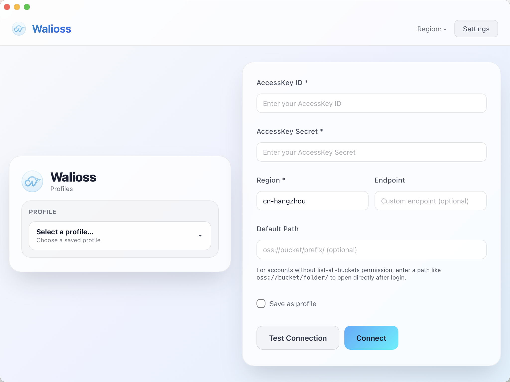

# Walioss

Walioss is a desktop Alibaba Cloud OSS client built with Wails + React.
It is designed for daily bucket/object operations with a native-app style workflow: profile-based login, tabbed browsing, paged object listing, previews, bookmarks, and transfer tracking.

## Screenshots

### Login & profile picker


### File list (paged) + operations


### Fast folder jump from breadcrumbs


### File preview


### Bookmarks


### Settings


## Features

### Connection & profiles
- Save multiple OSS profiles and mark one as default.
- Test connection before login.
- Support `Default Path` (`oss://bucket/prefix/`) for users without `ListBuckets` permission.
- Detect `ossutil` automatically (or configure a custom path in settings).

### Navigation & tabs
- Multi-tab workspace with add/close/rename support.
- Keyboard shortcuts: `Cmd/Ctrl+T`, `Cmd/Ctrl+W`, `Cmd/Ctrl+1..9`.
- Back/forward/up/refresh controls in each tab.
- Editable address bar (`oss://...`) with breadcrumb navigation.
- Hover breadcrumbs to open a subfolder popover (lazy loaded).
- New tab naming rule in settings:
  - `Current Folder`
  - `New Tab`
- If a tab is manually renamed, it stays fixed and no longer auto-updates.

### Object listing & operations
- Paged object listing with `Prev` / `Next` / jump-to-page / page size selector.
- Column width resizing by dragging table header separators.
- Full-width table layout (no horizontal scrolling in default view).
- Row selection with checkboxes, multi-select, and `Shift` range selection.
- Batch operations on selected rows:
  - Move
  - Delete
- Per-item operations:
  - Open folder
  - Preview file
  - Download file
- Create folder, create empty file, upload file.
- Drag-and-drop move:
  - Into folders in the current table
  - Into another tab
- Custom in-app context menu (browser default context menu is disabled).

### Preview
- Supported preview types:
  - Text/code
  - Image
  - Video
  - PDF
- Text preview includes lightweight syntax highlighting.
- Editable text files can be saved back to OSS.
- Preview metadata includes elapsed time, size, type, and object properties.
- Click object path in preview header to copy.
- Keyboard support:
  - `Esc` closes preview
  - Arrow keys (`↑↓←→`) navigate between previewable files

### Transfers & notifications
- Upload/download queue with live progress events.
- Transfer modal with:
  - Separate Uploads / Downloads tabs
  - Search
  - Progress, speed, ETA, and status
  - Reveal/Open for completed downloads
- Toast notifications for settings and operation feedback.

### Appearance & app behavior
- Dark/Light themes with smooth transitions.
- Minimum window size is enforced (`900x760`).
- About dialog shows app name/GitHub link from `appinfo.json`, and version from `frontend/package.json` (fallback: `appinfo.json`).

## Tech stack
- Backend: Go + Wails + Alibaba Cloud OSS SDK
- Frontend: React + TypeScript + Vite
- Transfer/runtime CLI integration: `ossutil`

## Requirements
- Go `1.23+`
- Node.js `18+`
- `pnpm` (recommended)
- Wails CLI `v2.11+`
- `ossutil v2` (in `PATH` or at `bin/ossutil`)

## Build environment (Go + Wails)

Walioss is a Wails desktop app, so you need both a Go environment and a Wails CLI environment before building.

### 1) Install Go
- Install Go `1.23+`
- Verify:

```bash
go version
```

### 2) Install Node.js + pnpm
- Install Node.js `18+`
- Install pnpm (if missing):

```bash
npm install -g pnpm
pnpm -v
```

### 3) Install Wails CLI

```bash
go install github.com/wailsapp/wails/v2/cmd/wails@v2.11.0
```

Ensure the Go bin directory is in your `PATH` so `wails` can be found:
- macOS/Linux: `$(go env GOPATH)/bin`
- Windows: `%USERPROFILE%\\go\\bin`

Verify:

```bash
wails doctor
```

## Run in development

```bash
# from project root
pnpm -C frontend install
wails dev
```

## Build locally

```bash
# from project root
pnpm -C frontend install
wails build -clean
```

Build output is generated under `build/bin`.

If `wails` is not found, reopen your terminal after updating `PATH`, or run it with full path from your Go bin directory.

## Local data

Walioss stores local state under:
- `~/.walioss/profiles.json`
- `~/.walioss/settings.json`

Bookmarks are stored in browser-like local storage, scoped by profile:
- `oss-bookmarks:<profileName>`

## Acknowledgements
- [ossutil v1](https://github.com/aliyun/ossutil)
- [ossutil v2](https://www.alibabacloud.com/help/en/oss/developer-reference/ossutil-overview/)
- [oss-browser v1](https://github.com/aliyun/oss-browser)
- [oss-browser v2](https://help.aliyun.com/zh/oss/developer-reference/ossbrowser-2-0-overview/)
